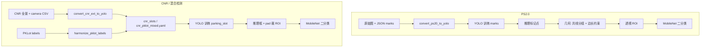

# Parking Slot Detection and Occupancy Recognition (YOLOv10)

本文说明本仓库**在做什么、怎么实现的、新人如何从零跑起来**。原始数据集与已训练权重不在仓库内，需自备或按脚本从公开数据准备；**涉及的数据集名称、用途与目录形态见第 2 节**。

---

## 1. 系统在解决什么问题

停车场场景中需要两件事：

1. **车位在哪里**：用目标检测给出「标记点」或「车位矩形」。
2. **车位空还是占**：在检测给出的区域上裁切 ROI，用 **MobileNetV3-Small 二分类**（occupied / vacant）判断占用。

本仓库把上述能力拆成 **可替换的检测权重 + 可替换的分类权重**，并提供 **PS2.0（标记点几何）** 与 **CNR（车位框）** 两套典型管线，以及 **CNR + PKLot 混合训练** 的检测数据配置。

---

## 2. 本程序使用的数据集

本仓库流程围绕下列数据（均需**自行获取**；版权、引用与下载方式以各数据集官方为准）。

| 数据集 | 在程序中的角色 | 典型内容与格式 | 相关脚本 / 配置 |
|--------|----------------|----------------|-----------------|
| **PS2.0 泊车场景数据** | 标记点检测、车位线几何评估、PS2.0 侧占用 ROI 及离线可视化 | 固定分辨率图像；JSON 含 `marks`（及可选 `slots`） | `convert_ps20_to_yolo.py`，`evaluate_slot_lines.py`，`crop_slot_rois_from_gt.py`，`configs/ps20_marks.yaml` |
| **CNR-EXT 全景（FULL_IMAGE 等）** | 车位**矩形框** YOLO 检测；可从全景裁 patch 做占用微调 | 常见约 1000×750；根目录 `camera*.csv` 与天气子目录 | `convert_cnr_ext_to_yolo.py`，`crop_cnr_patches_for_occ_dataset.py`，`configs/cnr_slots.yaml` |
| **CNR-EXT Patches（如 150×150）** | 仅占用分类：按官方列表训练 MobileNet | `PATCHES/` 与 `LABELS/*.txt`（每行：相对路径 + 标签） | `train_occ_classifier_cnr_ext_patches.py` |
| **PKLot**（如 Roboflow / Ultralytics 式 YOLO 导出） | 与 CNR **混合**训练单类车位检测（须先做标签 harmonize） | `train` / `valid` / `test` 下 `images` 与 `labels` | `harmonize_pklot_labels.py`，`configs/cnr_pklot_mixed.yaml` |

混合训练前请阅读 README 中关于 **PKLot 标签降维** 的说明，并对 PKLot 的 `labels` **做好备份**后再运行 `harmonize_pklot_labels.py`。

---

## 3. 整体思路（实现原理）

### 3.1 PS2.0 管线：标记点 → 入口线 → 透视 ROI → 分类

- **检测**：YOLO 在 600×600 图上检测 **marking point**（小框，单类 `marking_point`）。
- **几何**：在检测点集合上用距离阈值找共线点组，结合「短边 / 长边」长度约束，恢复与车位相关的 **线段 / 四边形**（与官方 JSON 中的 slot 几何对照评估）。
- **占用**：沿深度方向在图像上展开 **256×256** 透视补丁，送入 **ImageNet 预训练 + 替换最后一层为 2 类** 的 MobileNetV3-Small。

核心代码：`scripts/app_gradio.py`（单管线）、`scripts/app_gradio_ps20_cnr.py` 中的 PS2.0 分支（与前者几何逻辑一致，并与 CNR 并排）。

### 3.2 CNR 管线：车位框检测 → 框内 ROI → 分类

- **检测**：YOLO 在 1000×750 全景图上检测 **parking_slot** 矩形（由 CSV 缩放得到标签，见转换脚本）。
- **占用**：按检测框（可加 pad）裁图，**224×224** 送入同一结构的 MobileNet；尺寸分桶等用于可视化与阈值逻辑（见 Gradio 内 `CnRParams`）。

核心代码：`scripts/app_gradio_ps20_cnr.py` 的 CNR 分支。

### 3.3 为何有「混合检测」CNR + PKLot

CNR 标签只有「车位框」一类；PKLot 常见为「空 / 占」两类。若直接混合，占用车位会被当成另一类，与 CNR 语义冲突。做法是先把 PKLot 的类别 **全部 harmonize 成 0**，混合后模型只做 **找框**；占用仍交给分类器。见 `scripts/harmonize_pklot_labels.py` 与 `configs/cnr_pklot_mixed.yaml`。

### 3.4 数据流总览（便于对照脚本）



---

## 4. 环境与安装

| 项 | 说明 |
|----|------|
| Python | 推荐 **3.10**（与常用 PyTorch 轮子一致） |
| 依赖 | `pip install -r requirements.txt`（含 `ultralytics`, `torch`, `torchvision`, `opencv-python`, `numpy`, `gradio`） |
| GPU | 训练/推理均可 CPU，但检测与分类训练强烈建议 CUDA |
| Windows | 许多脚本将 `num_workers` / `workers` 设为 **0**，避免 DataLoader 多进程问题 |

**本机若已用 Conda 环境（例如 `parking_env`）**：先 `conda activate parking_env`，再执行下方命令。若终端没有 `yolo` 命令，可用：

`python -c "from ultralytics import YOLO; YOLO('yolov10s.pt').train(...)"`

把 `train(...)` 的参数与下文 YAML 一致即可。

---

## 5. 新人建议阅读顺序

1. 看 **「2. 本程序使用的数据集」** 与 **「6. 目录与配置」**，改好本机路径与 `configs/*.yaml`。
2. 若只跑演示：跳到 **「10. Gradio 可视化」**。
3. 若要复现检测训练：**「7. 数据准备」** → **「8. 检测训练」**。
4. 若要复现占用分类：**「7. 数据准备」** 中占用相关小节及对应训练脚本。
5. 需要对照某个工具：**「11. 脚本一览」**。

---

## 6. 目录与配置

```
parking-slot-yolov10/
  configs/           # YOLO data.yaml 等
  scripts/           # 全部可执行逻辑
  runs/detect/       # 默认检测训练输出（本机生成，通常不入库）
  docs/              # 示意图
  requirements.txt
```

| 配置文件 | 作用 |
|----------|------|
| `configs/ps20_marks.yaml` | PS2.0 **标记点**检测；`path` 指向 YOLO 数据根（其下有 `images/train` 等） |
| `configs/cnr_slots.yaml` | CNR **车位框**检测；`path` 应对齐 `convert_cnr_ext_to_yolo.py` 的 `OUT_ROOT` |
| `configs/cnr_pklot_mixed.yaml` | CNR + PKLot **混合单类**检测；`train`/`val` 为多路径列表，**必须改为你本机绝对路径** |

脚本里大量 **文件顶部常量**（如 `E:\...`）为作者本机路径；**换机器后请全局搜索并修改**，或通过带 argparse 的脚本用命令行参数覆盖。

---

## 7. 数据准备

### 7.1 PS2.0 → YOLO（标记点）

- **脚本**：`scripts/convert_ps20_to_yolo.py`
- **修改**：文件顶部的 `IMG_TRAIN_SRC`, `JSON_TRAIN_SRC`, `OUT_ROOT` 等。
- **输出**：`OUT_ROOT/images/{train,val,test}` 与对应 `labels/*.txt`（YOLO 归一化框）。
- **训练配置**：保证 `configs/ps20_marks.yaml` 的 `path` 指向该 `OUT_ROOT`（或你把数据拷到 yaml 所写路径）。

### 7.2 CNR-EXT → YOLO（车位框）

- **脚本**：`scripts/convert_cnr_ext_to_yolo.py`
- **修改**：`CNR_ROOT`, `OUT_ROOT`；可选 `LABEL_MODE`：`slot_bbox`（推荐）或 `mark_center`（实验用小框）。
- **输出**：`OUT_ROOT/images/train|val` 与 `labels`。
- **同步**：`configs/cnr_slots.yaml` 的 `path` 与 `OUT_ROOT` 一致。

### 7.3 PKLot 标签与 CNR 混合（仅用于检测）

1. **备份** PKLot 数据集（脚本会原地改 txt）。
2. 修改 `scripts/harmonize_pklot_labels.py` 末尾的 `base_dir`，运行：  
   `python scripts/harmonize_pklot_labels.py`  
   将各类别统一为 `0`。
3. 编辑 `configs/cnr_pklot_mixed.yaml` 中 CNR 与 PKLot 的 `train`/`val` 路径。

### 7.4 PS2.0 占用分类数据集（ImageFolder）

典型流程（脚本内路径需自行修改）：

1. `scripts/crop_slot_rois_from_gt.py`：根据 JSON 与几何规则裁 **patches**，写 `slot_roi_metadata.csv`。
2. `scripts/label_slot_patches.py`：OpenCV 窗口逐张标 vacant/occupied，写回 CSV。
3. `scripts/build_occ_dataset_from_csv.py`：按 CSV 划分 `train/val/test` 下 `occupied/`、`vacant/`。
4. `scripts/train_occ_classifier.py`：读 `DATA_ROOT`（ImageFolder），训练并保存 `best_mobilenetv3_small.pth`。

目录名 **`vacant` 与 `occupied` 的字母序** 会影响类别下标；Gradio 中有「交换类别索引」选项用于纠正显示反了的情况。

### 7.5 CNR 占用：补丁裁剪 + 微调 或 官方 patch 列表

- **从全景裁块 + 人工整理 + 微调**：  
  `scripts/crop_cnr_patches_for_occ_dataset.py` → 人工复制到 `train/occupied|vacant` → `scripts/split_occ_train_val.py` → `scripts/finetune_occ_classifier_cnr.py`（需 `--data_root`, `--pretrained`, `--save_dir`）。
- **CNR-EXT 150×150 官方列表训练**：  
  `scripts/train_occ_classifier_cnr_ext_patches.py`（见文件头注释与 `--help`）。

---

## 8. 检测训练（Ultralytics YOLO）

在仓库根目录执行（示例）：

```bash
# PS2.0 标记点
yolo task=detect mode=train model=yolov10s.pt data=configs/ps20_marks.yaml epochs=100 imgsz=640 batch=16 workers=0 project=runs/detect name=ps20_marks

# CNR 车位框
yolo task=detect mode=train model=yolov10s.pt data=configs/cnr_slots.yaml epochs=... project=runs/detect name=cnr_slots

# CNR + PKLot 混合（标签已 harmonize）
yolo task=detect mode=train model=yolov10s.pt data=configs/cnr_pklot_mixed.yaml epochs=30 batch=4 workers=0 imgsz=640 project=runs/detect name=train_mixed_final
```

权重一般在 `runs/detect/<name>/weights/best.pt`。

**多模型对比（PS2.0 同一 yaml）**：`scripts/benchmark_ps20_detectors.py`（可训练多 backbone 并写 CSV）。

---

## 9. 车位线评估与批量 benchmark

- **单模型、与 GT 线段匹配指标**：`scripts/evaluate_slot_lines.py`  
  默认路径在脚本内，可用参数覆盖 `--img_dir`, `--json_dir`, `--txt_dir`（预测标签目录）等。
- **多权重批量 predict + 调 evaluate**：`scripts/batch_slot_line_benchmark.py`  
  示例见文件头；可通过 `--benchmark_csv` 或 `--weights` + `--tags` 指定多组实验。

---

## 10. Gradio 可视化（给业务/答辩演示）

| 应用 | 命令 | 端口 | 说明 |
|------|------|------|------|
| 单管线 PS2.0 | `python scripts/app_gradio.py` | **7860** | 一个 YOLO 检测 + 一个 MobileNet；界面里填 `.pt` / `.pth` |
| PS2.0 + CNR 双套模型 | `python scripts/app_gradio_ps20_cnr.py` | **7861** | 两套检测 + 两套分类；切换「推理模式」；含 Legacy BGR、NMS、CNR 框参数等 |

界面默认路径仍为作者机器示例，**首次使用请在文本框中改成你的 `best.pt` 与 `.pth`**。

若本机走代理导致打不开 `127.0.0.1`，脚本已设置 `NO_PROXY`；仍异常时可检查系统代理。

---

## 11. 脚本一览（按用途）

| 脚本 | 用途摘要 |
|------|----------|
| `convert_ps20_to_yolo.py` | PS2.0 图 + JSON → YOLO 标记点数据集 |
| `convert_cnr_ext_to_yolo.py` | CNR-EXT 全景 + camera CSV → YOLO 车位框 |
| `harmonize_pklot_labels.py` | PKLot 多类标签改为单类 0，供混合检测 |
| `benchmark_ps20_detectors.py` | 多检测模型在同一 data yaml 上训练/验证并导出 CSV |
| `evaluate_slot_lines.py` | 标记点预测 → 几何车位线 vs GT，算 P/R/F1 等 |
| `batch_slot_line_benchmark.py` | 批量权重 predict + 汇总车位线指标 |
| `crop_slot_rois_from_gt.py` | PS2.0：由 GT 生成车位 ROI patch + metadata CSV |
| `label_slot_patches.py` | 键盘标注 patch 空/占到 CSV |
| `build_occ_dataset_from_csv.py` | 已标注 CSV → ImageFolder 占用数据集 |
| `train_occ_classifier.py` | PS2.0 占用：ImageFolder 上训练 MobileNet |
| `crop_cnr_patches_for_occ_dataset.py` | CNR：裁块 → `raw_crops`，供人工分类 |
| `split_occ_train_val.py` | 从 train 再划出一部分 val |
| `label_occ_patches_hotkey.py` | CNR patch 热键标注 |
| `finetune_occ_classifier_cnr.py` | 在 CNR 域数据上微调占用分类 |
| `train_occ_classifier_cnr_ext_patches.py` | CNR-EXT 150×150 列表训练占用分类 |
| `visualize_yolo_labels.py` | 叠加可视化 YOLO 标签与 JSON 车位线 |
| `draw_gt_slot_lines.py` / `draw_pred_slot_lines.py` | 绘制 GT / 预测车位线示意图 |
| `analyze_gt_slot_lengths.py` | 分析 GT 线段长度分布（调几何阈值参考） |
| `end_to_end_visualize.py` | 离线批量端到端可视化（脚本内改路径） |
| `app_gradio.py` | PS2.0 单管线 Web 演示 |
| `app_gradio_ps20_cnr.py` | PS2.0 + CNR 双管线 Web 演示 |

---

## 12. 历史实验指标（仅供参考）

以下为仓库记录过的实验数字，**随数据与随机种子变化**，复现不必强求一致。

- **标记点检测**：P / R / mAP50 / mAP50-95 ≈ 0.993 / 0.993 / 0.995 / 0.896  
- **车位线几何评估**：P / R / F1 ≈ 0.982 / 0.923 / 0.951  
- **占用分类**：Accuracy ≈ 0.9807，P / R / F1 ≈ 0.9729  

---

## 13. 说明与许可

- 本仓库**不包含** PS2.0、CNR、PKLot 原始数据及训练产物；`runs/` 下内容多为本机生成，若需协作请在 `.gitignore` 中保持忽略大文件。
- 使用第三方数据集与预训练权重时，请遵守各自许可证与引用要求。
